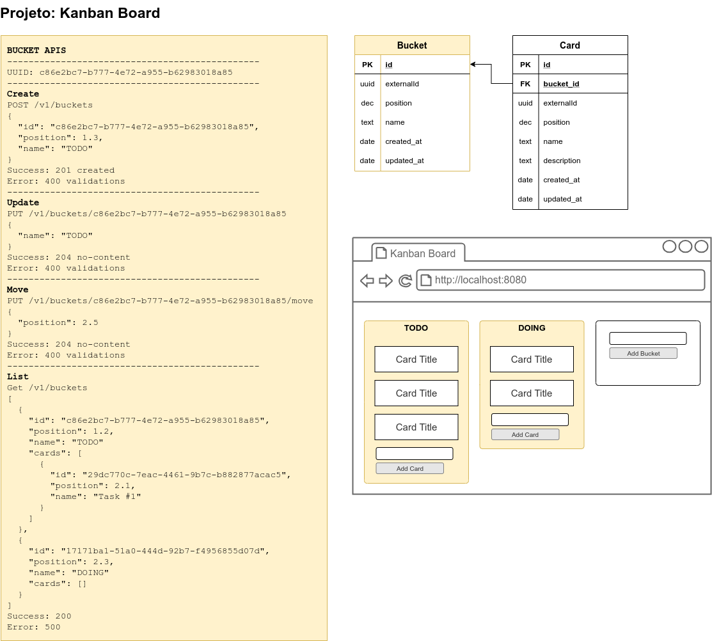
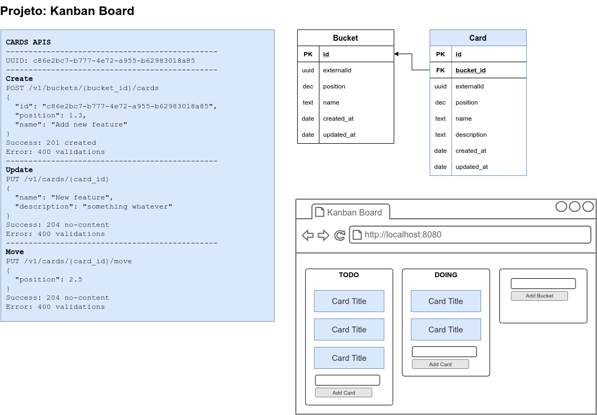

# Projeto: Kanban Board

**Videos deste projeto**: https://www.youtube.com/user/mariorez

Versão **SPRING-BOOT**: https://github.com/mariorez/kanban-board

## Stack da aplicação

- **JAVA** [11]: https://sdkman.io/
- **QUARKUS** [1.6]: https://quarkus.io/
- Maven: https://sdkman.io/
- Postgres: https://hub.docker.com/_/postgres

## Levantando a aplicação

1 - Levantar o **Banco-de-Dados POSTGRES**:
```
docker-compose up -d
```

2 - Levantar o **QUARKUS**:
```
mvn clean compile quarkus:dev
```

## Documentação API

**Open API**: http://localhost:8080/swagger-ui/

## Documentos complementares





## Geral

**Verificar atualização dos pacotes**
```
mvn versions:display-dependency-updates
```

**Verificar atualização dos plugins**
```
mvn versions:display-plugin-updates
```
